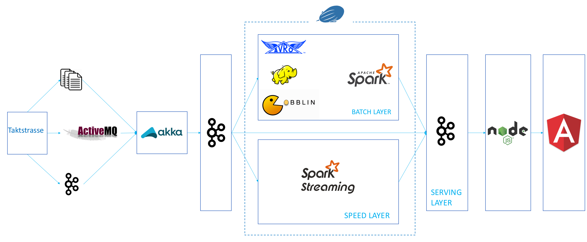
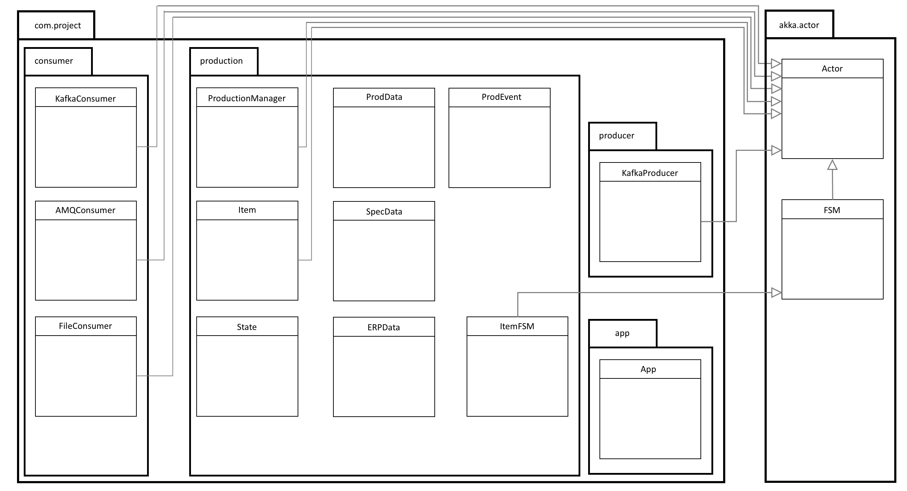
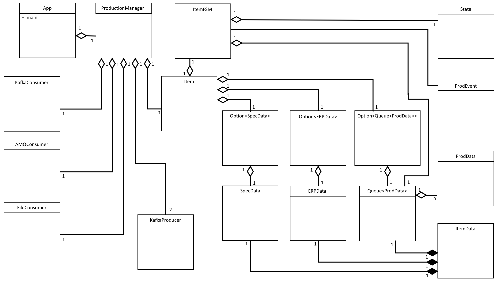
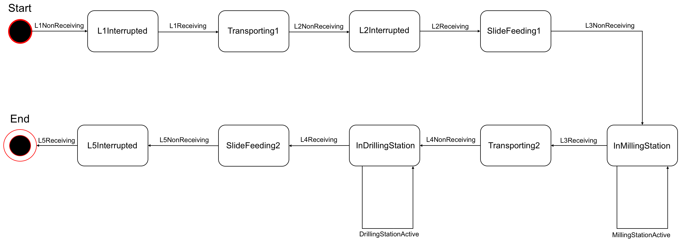

# __Factory 4.0__

## Anwendung starten
<br />
### Initialisierung
Um die Applikation auszuführen müssen folgende Schritte durchlaufen werden:
* Zsh, Bash, CMD oder eine andere Konsole ist geöffnet.
* Es wurde zum Verzeichnis _/dhbw-projekt/docker_ navigiert und die _docker-compose.yml_ ist vorhanden.
* Für die Initialisierung können die folgenden Kommandos verwendet werden.

```
docker-compose up --build
```
oder
```
docker-compose build
docker-compose up
```
oder
```
docker-compose up
```

* An der Stelle wird gebeten ca. __7 Minuten__ zu warten, um sicherzustellen, dass alle Container geladen sind und laufen. <br />
Alternativ: Sobald in der Commandline `Webserver: Running on http://localhost:49160` steht, kann der Frontend aufgerufen werden.
* Das UI kann in handelsüblichen Browsern unter der Adresse `http://localhost:49160` erreicht werden. 
 

<br />
### Neustarten
Für einen Neustart der Applikation __muss zwingend__ das Flag ```--force-recreate``` gesetzt werden, damit eine frische Initialisierung der Container sichergestellt wird. <br />
```docker-compose``` stellt die Löschung der Volumen nicht sicher, weshalb bspw. Hadoop Probleme bereiten kann. <br />
Das Kommando sieht also folgendermaßen aus: 
```
docker-compose up --force-recreate
```
Auch hier sollte __7 Minuten__ gewartet werden, bevor man auf das UI unter der Adresse `http://localhost:49160` zugreift.

<br /><br />
## Backend
### Docker
Die Infrastruktur besteht aus acht simultan laufenden, miteinander kommunizierenden Docker-Containern:
* _zeppelin_
* _gobblin_
* _spark_
* _node_
* _activemq_
* _kafka_
* _hadoop_
* _taktstrasse_ </br />

Ist die Applikation einmal lauffähig und wird ausgeführt, kann mit folgendem Kommando eine Übersicht über die aktiven Container gewonnen werden: <br />
```
docker ps
```
Der Output sollte etwa wie folgt aussehen: 
```
13:45 $ docker ps
CONTAINER ID        IMAGE                COMMAND                  CREATED             STATUS              PORTS                                                                                                                                                                                NAMES
b5cdb2b05d1d        docker_zeppelin      "/bin/sh -c /start.sh"   10 seconds ago      Up 7 seconds        0.0.0.0:8000->8080/tcp                                                                                                                                                               docker_zeppelin_1
b89696170bfd        docker_gobblin       "/bin/sh -c /start.sh"   13 seconds ago      Up 9 seconds                                                                                                                                                                                             docker_gobblin_1
24c68224f8d7        docker_taktstrasse   "/bin/sh -c /start.sh"   13 seconds ago      Up 9 seconds                                                                                                                                                                                             docker_taktstrasse_1
7efbc1649859        docker_spark         "/bin/sh -c /start.sh"   13 seconds ago      Up 10 seconds       0.0.0.0:7077->7077/tcp, 0.0.0.0:8080->8080/tcp                                                                                                                                       docker_spark_1
7a204fd2c19a        docker_node          "/bin/sh -c /start.sh"   14 seconds ago      Up 10 seconds       0.0.0.0:49160->8080/tcp                                                                                                                                                              docker_node_1
a96963fdf45b        docker_activemq      "/bin/sh -c /start.sh"   16 seconds ago      Up 13 seconds       0.0.0.0:61616->61616/tcp                                                                                                                                                             docker_activemq_1
d8b9bdb727ca        docker_kafka         "/bin/sh -c /start.sh"   16 seconds ago      Up 14 seconds       0.0.0.0:2181->2181/tcp, 0.0.0.0:9092->9092/tcp                                                                                                                                       docker_kafka_1
417ff9f130a9        docker_hadoop        "/bin/sh -c /start.sh"   16 seconds ago      Up 13 seconds       0.0.0.0:9000->9000/tcp, 0.0.0.0:50030->50030/tcp, 0.0.0.0:50060->50060/tcp, 0.0.0.0:50070->50070/tcp, 0.0.0.0:50075->50075/tcp, 0.0.0.0:50090->50090/tcp, 0.0.0.0:50105->50105/tcp   docker_hadoop_1
```
<br />
### Datenfluss
Die von der Taktstrasse erzeugten Daten werden in drei verschiedenen Outputquellen verfügbar gemacht: Dateien auf dem Filesystem, ein Kafkastream und ein ActiveMQ-Broker. <br /> 
Eine in Scala programmierte Akka-basierte Applikation konsumiert alle drei verfügbaren Datenquellen, bündelt diese zu einem Objekt und gibt diese in einen Kafkastream ein. <br />
Diesen abonniert die eigentliche Analyseanwendung, welche gemäß der Lambda-Architektur in Batch-Layer, Speed-Layer und Serving-Layer aufgeteilt ist. <br />
In der Speed-Layer werden einfache, schnelle Analysen durchgeführt.<br />
Die Batch-Layer stünde für tiefgreifende Analysen bereit, findet aber aufgrund der zu geringen Batchgröße keine wirkliche Anwendung. <br />
Livedaten, die zum Monitoring der Taktstraße dienen, können vom Node.js Server direkt aus Kafka konsumiert werden, nachdem sie von der Akka-Applikation aufbereitet wurden. <br /><br />
Das Zusammenspiel der einzelnen Container und der Fluss der Daten kann folgendermaßen visualisiert werden: <br /><br />

<br />

### Akka
Die auf Scala basierte Anwendung, die für das Konsumieren, Bündeln und Bereitstellen der Daten zuständig ist, wurde mit Hilfe des Akka Frameworks, d.h. Actor-based, implementiert. 
Das Projekt besteht aus 3 Struktur-gebenden Paketen, deren Inhalt in der folgenden Abbildung visualisiert ist.  
Es sollte für den Betrachter ersichtlich sein welche implementierten Klassen von Klassen des Pakets _akka.actor_ erben. 
<br /><br />
 
<br /><br />
Um den Zusammenhang der einzelnen Klassen zu veranschaulichen dient die folgende Grafik. 
Kern der Applikation ist die Klasse _App_ über deren _main_-Methode der Start erfolgt.
_App_ verwaltet einen _ProductionManager_, dessen Aufgabe die Überwachung der Produktion ist.
Der _ProductionManager_ hat drei Consumer, jeweils einen _KafkaConsumer_, _AMQConsumer_ und _FileConsumer_, sowie zwei _KafkaProducer_, die message-driven und asynchron agieren.
Die drei Consumer erschließen die drei unterschiedlichen Outputs der Taktstraße. 
Die zwei _KafkaProducer_ sind für das Einstellen der gebündelten Daten in die Topics _live_ und _spark_ zuständig.
<br /><br />

<br /><br />
Um die Verarbeitung der Inputquellen innerhalb der Anwendung zu erklären, muss der unten sichtbare Zustandsautomat bekannt sein. 
<br /><br />

<br /><br />

### Kafka
Es werden verschiedene Kafka-Topics verwendet um die Streams zu organisieren. <br />
Die gestreamten Livedaten können beispielsweise dem Topic _live_ entnommen werden, die Analyseergebnisse bzgl. Kunden und Material den Topics _customer_, bzw. _material_ und die aus der Taktstrasse stammenden Rohdaten dem Topic _prod_. <br />
Insgesamt sind es die folgenden fünf Topics:
* _live_
* _spark_
* _prod_
* _customer_
* _material_ <br />

<br /><br />
## Frontend
### Technologien 
#### Node.js
Mittels Node wird der Server für das Frontend bereitgestellt. <br />
Es kommen verschiedene, unterstützende Module zum Einsatz:
* _path_ 
* _moment_
* _kafka-node_
* _http_ 
* _express_ 
* _socket.io_

#### C3.js
Zur Visualisierung wird die Open-Source Chartlibrary c3.js verwendet. <br />
Es kommen verschiedene Diagrammtypen zum Einsatz. <br />
#### Angular.js
Bei der Erstellung des Frontends wurde auf das Framework Angular.js gesetzt. <br />
Das MVC Konzept wurde umgesetzt. Es existieren Views für folgende Benutzersichten: <br />
* Dashboard Startseite
* Charts für genauere Analysen
* Infos zu Materialien
* Infos zu Kunden

Es wurde eine Factory für _socket.io_ genutzt um mehrere, einheitliche Services bereitstellen zu können. <br />
_Socket.io_ wird für die Echtzeitweitergabe der Daten aus den Kafka-Streams verwendet. <br />


